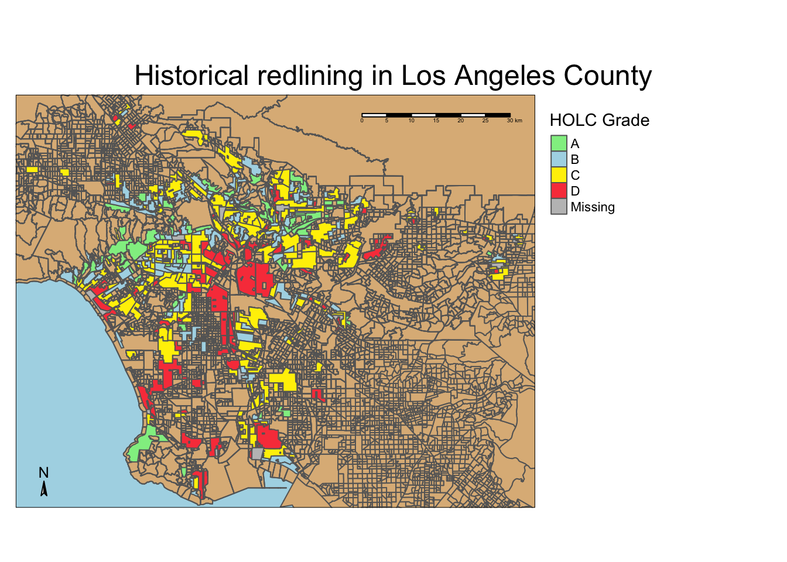

## The environmental impacts of redlining in LA County



### Purpose

This repository explores the effects of historical redlining in Los Angeles County through environmental factors and biodiversity observations. This is accomplished through the combination of Home Owners' Loan Corporation (HOLC) data and the EPA's EJ screen data.

### Repository structure

```bash
la_holc_EJ_impacts
│
├── .gitignore 
├── data                        
│   ├── ejscreen
│   ├── gbif-birds-LA
│   ├── mapping-inequality
│ 
├── images                      
│   ├── map.png
│
├── la_holc_EJ_impacts.files
│     ├── figure-html
│     ├── libs
│
├── la_holc_EJ_impacts.html
├── la_holc_EJ_impacts.qmd
├── la_holc_EJ_impacts.Rproj
├── README.md  
│
```

### Data

All relevant data available [here](https://drive.google.com/file/d/14CauXFZkVh_6z2Euq0m1Sq1kHQ31fiMk/view?usp=drive_link).

### Authors and contributors

Liz Peterson

Contributor: Dr. Ruth Oliver wrote this assignment for EDS 223: Geospatial Analysis & Remote Sensing

### Sources

U.S. Environmental Protection Agency (EPA), 2024. EJScreen Technical Documentation.

Federal Loan Agency. Federal Home Loan Bank Board. Home Owners' Loan Corporation. ( 07/01/1939 - 02/24/1942)

Ellis-Soto, D., Chapman, M., & Locke, D. H. (2023). Historical redlining is associated with increasing geographical disparities in bird biodiversity sampling in the United States. Nature Human Behaviour, 1-9.

Global Biodiversity Information Facility, 2024

